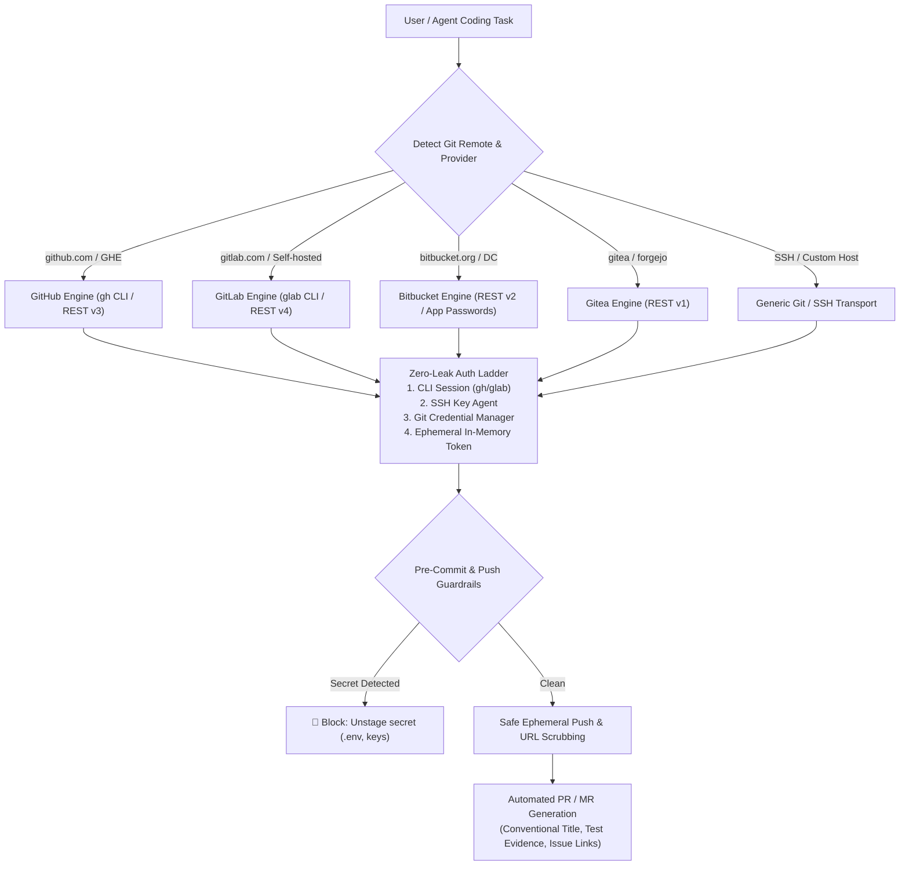

# Agent Git Integration 🚀

[](LICENSE)
[](#-provider-coverage)
[](SKILL.md)
[](references/workflow-profiles.md)
[](references/authentication-matrix.md)

> **Enterprise multi-provider Git automation engine for AI coding agents. Automates repository lifecycles, zero-leak authentication, customizable team workflows, conventional commits, and safety guardrails across GitHub, GitLab, Bitbucket, and Gitea.**

---

## 🌟 Why Agent Git Integration?

Autonomous coding agents (Google Antigravity, Claude Code, Cursor, Aider, Windsurf) need to manipulate repositories autonomously. However, naive implementations suffer from critical flaws:

1. **Token Leaks**: Storing personal access tokens in `.git/config` remote URLs or printing them to console transcripts.
2. **Provider Lock-in**: Hardcoding GitHub commands while failing in enterprise GitLab, Bitbucket, or self-hosted Gitea environments.
3. **Disorganized History**: Writing generic commit messages (`"update files"`) and pushing unreviewed changes directly to production branches.
4. **Accidental Disasters**: Overwriting team branches with un-leased force pushes or committing secret keys (`.env`, `*.pem`).

**Agent Git Integration solves this with a unified, secure abstraction layer.**

---

## 🧭 System Architecture



---

## 🌐 Provider Coverage

| Provider | Supported Environments | Primary Tooling | API Fallback | PR / MR Support |
| :--- | :--- | :--- | :--- | :--- |
| **GitHub** | GitHub.com, GitHub Enterprise Server | `gh` CLI | REST API v3 / GraphQL | ✅ Automated PRs |
| **GitLab** | GitLab.com, GitLab CE/EE Self-Hosted | `glab` CLI | REST API v4 | ✅ Automated MRs |
| **Bitbucket** | Bitbucket Cloud, Bitbucket Data Center | Git + App Passwords | REST API v2 | ✅ Automated PRs |
| **Gitea / Forgejo**| Self-Hosted Lightweight Git | Git + Tokens | REST API v1 | ✅ Automated PRs |
| **Generic Git** | Bare SSH, Custom Remotes | Pure Git & SSH | Native Git Protocol | Branch Push & Sync |

---

## 🔐 Zero-Leak Credential Security

Security is built directly into every protocol:
- **Ephemeral Token Injection**: Tokens are read directly into shell memory only for the duration of the push command.
- **Immediate Remote Sanitization**: The remote origin URL on disk is immediately scrubbed back to standard clean HTTPS:
  ```powershell
  # Token exists only in this memory pipeline
  git push "https://$token@github.com/$owner/$repo.git" main
  # Remote is instantly reset to remove credentials from .git/config
  git remote set-url origin "https://github.com/$owner/$repo.git"
  ```
- **Pre-Push Secret Guard**: Automatically scans staged files for `.env`, `*Token*`, `*Credentials*`, and private keys before committing.
- **Protected Branch Guard**: Blocks accidental direct commits or raw `--force` pushes to `main`, `master`, and `production`. History rewrites require `--force-with-lease`.

---

## ⚙️ Configuration & Customization (`config.json`)

Customize preferences in `config.json`:

```json
{
  "default_provider": "github",
  "workflow": {
    "strategy": "trunk-based",
    "feature_branch_prefix": "feat/",
    "fix_branch_prefix": "fix/",
    "commit_convention": "conventional",
    "protected_branches": ["main", "master", "production"]
  },
  "safety": {
    "block_secret_commits": true,
    "force_with_lease_only": true,
    "confirm_protected_push": true,
    "scrub_credentials_from_remote": true
  },
  "providers": {
    "github": {
      "enabled": true,
      "auth_mode": "token_file",
      "token_path": "~/.config/git-integration/github_token.txt",
      "use_cli_if_available": true
    },
    "gitlab": {
      "enabled": false,
      "auth_mode": "token_file",
      "token_path": "~/.config/git-integration/gitlab_token.txt",
      "api_endpoint": "https://gitlab.com/api/v4"
    }
  }
}
```

---

## 📦 Quickstart & Installation

### Option 1: Google Antigravity (AGY)
Copy the skill folder into your Antigravity skills configuration:
```bash
# Global skills directory
cp -r . ~/.gemini/config/skills/git-integration/
```

### Option 2: Project-Level Usage
Place in your project's `.agents/skills/` folder:
```bash
mkdir -p .agents/skills/
cp -r . .agents/skills/git-integration/
```

---

## 📚 Deep Reference Modules

- **[Master Skill Runbook](SKILL.md)**: Routing logic, pre-flight checks, and command protocol.
- **[Authentication Matrix & Security](references/authentication-matrix.md)**: Credential resolution ladder and zero-leak protocols.
- **[GitHub Operations](references/github-operations.md)**: GitHub CLI (`gh`) and REST API v3/GraphQL automation.
- **[GitLab Operations](references/gitlab-operations.md)**: GitLab CLI (`glab`) and REST API v4 automation.
- **[Bitbucket Operations](references/bitbucket-operations.md)**: Bitbucket Cloud/Server REST v2 & App Passwords.
- **[Gitea & Forgejo Operations](references/gitea-operations.md)**: Self-hosted lightweight Git APIs.
- **[Workflow Profiles & Commits](references/workflow-profiles.md)**: Trunk-based vs Git-flow, Conventional Commits standard.
- **[Safety & Guardrails](references/safety-and-guardrails.md)**: Secret scanning patterns and protected branch rules.

---

## 🛠️ Helper Automation Scripts

- **`scripts/provider-auth-check.ps1`**: Probes configured API endpoints non-destructively and validates authentication without outputting tokens.
- **`scripts/safe-remote-sync.ps1`**: Pushes changes using ephemeral in-memory credentials, ensuring `.git/config` is never contaminated.

---

## 🤝 Contributing

Contributions, additional provider adapters (e.g. AWS CodeCommit, Azure DevOps), and workflow presets are welcome! Please check out [CONTRIBUTING.md](CONTRIBUTING.md).

---

## 📄 License

Distributed under the [MIT License](LICENSE). Built by [Amin Fallah](https://github.com/AminFallah4252).
