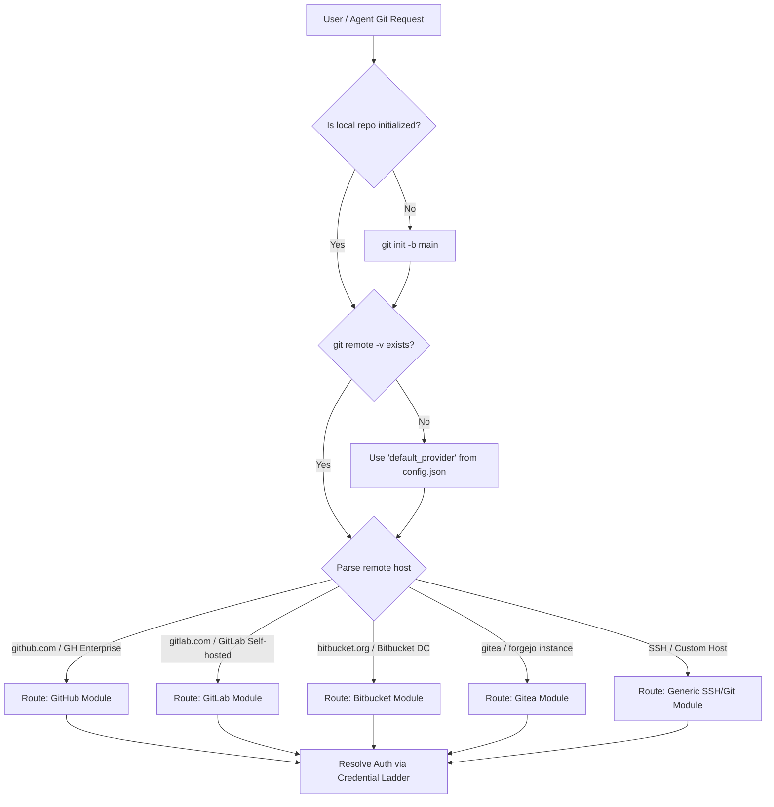

# Multi-Provider Git Integration Skill

Unified, enterprise-grade Git automation across all major hosting platforms with automated provider routing, zero-leak credential management, and customizable team workflows.

---

## 🧭 Fast Provider & Remote Router

Before running any remote Git operation, determine the target provider:



---

## 🔐 Credential Resolution Ladder (Zero-Leak Security)

Always resolve credentials using this strict priority order:

1. **Native CLI Session**:
   - For GitHub: Check `gh auth status`. If authenticated, prioritize `gh` commands.
   - For GitLab: Check `glab auth status`. If authenticated, prioritize `glab` commands.
2. **SSH Key Agent**:
   - If an SSH remote is configured (`git@<host>:...`) or `~/.ssh/` key exists, use standard SSH transport.
3. **Local Config / Token File**:
   - Check `config.json` in this skill directory for the configured `token_path`.
   - Default GitHub path: `d:/Projects/Personal/Antigravity/GithubAccessToken.txt`.
   - Read token into an **ephemeral in-memory shell variable**.
4. **Security Directives (CRITICAL)**:
   - **Never print tokens to console or conversation transcripts.**
   - **Never leave tokens embedded in `.git/config` remote URLs.**
   - When pushing via token, use dynamic push syntax or immediately scrub the remote URL back to clean HTTPS.

---

## ⚡ Quick Operational Workflows

### 1. Initializing & Publishing a New Repository
When creating a new repository from a local folder:

1. **Pre-flight**: Ensure `.gitignore` is present and protective.
2. **Git Init**: `git init -b main`
3. **Stage & Commit**:
   ```bash
   git add .
   git commit -m "feat: initial commit"
   ```
4. **Create Remote Repository via API/CLI**:
   - **GitHub**:
     ```powershell
     # Using gh CLI:
     gh repo create <repo-name> --public --source=. --remote=origin --push
     # OR via REST API: See references/github-operations.md
     ```
   - **GitLab**:
     ```powershell
     glab repo create <repo-name> --public
     # OR via REST API: See references/gitlab-operations.md
     ```
   - **Bitbucket / Gitea**: See matching reference documents in `references/`.

5. **Push Safely**:
   If pushing via token, immediately sanitize remote:
   ```powershell
   $token = (Get-Content $tokenPath).Trim()
   git push "https://$token@github.com/$owner/$repo.git" main
   git remote set-url origin "https://github.com/$owner/$repo.git"
   ```

---

### 2. Feature Branching & Conventional Commits

Adhere to the configured workflow (`trunk-based` or `git-flow` from `config.json`):

1. **Create Branch**:
   - Features: `git checkout -b feat/<short-description>`
   - Bug fixes: `git checkout -b fix/<short-description>`
   - Refactors: `git checkout -b refactor/<short-description>`
2. **Secret Scan Pre-Check**:
   Before staging, verify no sensitive files are included:
   ```powershell
   git status --short | Select-String -Pattern "(\.env|token|credentials|key|\.pem)"
   ```
   If detected, halt immediately and prompt user or add to `.gitignore`.
3. **Commit with Conventional Specification**:
   - Format: `<type>(<scope>): <concise description in imperative present tense>`
   - Types: `feat`, `fix`, `docs`, `style`, `refactor`, `perf`, `test`, `chore`.

---

### 3. Pull Request / Merge Request Creation

When ready to merge a feature branch:

1. Push feature branch to remote origin.
2. Open PR / MR using provider CLI or API:
   - **GitHub**:
     ```bash
     gh pr create --title "feat: <title>" --body "<description with summary & checklist>"
     ```
   - **GitLab**:
     ```bash
     glab mr create --title "feat: <title>" --description "<description>"
     ```
   - If CLI is unavailable, fallback to REST API endpoints documented in `references/`.
3. Include standard PR sections:
   - **Summary**: What changed and why.
   - **Verification**: How changes were tested.
   - **Checklist**: Linting, documentation, test pass.

---

### 4. Syncing & Upstream Rebase

Keep feature branches fresh:
```bash
git fetch origin main
git rebase origin/main
# If conflicts occur, resolve cleanly or abort:
# git rebase --abort
```

---

## 🛡️ Safety & Guardrails Summary

- **Protected Branch Guard**: Never force-push or commit directly to `main`, `master`, or `production` without explicit user sign-off.
- **Force Pushes**: Always use `--force-with-lease`, never raw `--force`.
- **Credential Scrubbing**: Remote URLs in `.git/config` must remain strictly `https://<host>/...` or `git@<host>:...`.

---

## 📖 Deep Reference Modules

- **[Authentication Matrix & Security](references/authentication-matrix.md)**: Full resolution rules, GCM, SSH, and token hygiene.
- **[GitHub Operations](references/github-operations.md)**: `gh` CLI, REST API v3, GraphQL, PR templates.
- **[GitLab Operations](references/gitlab-operations.md)**: `glab` CLI, REST API v4, MR pipelines.
- **[Bitbucket Operations](references/bitbucket-operations.md)**: Bitbucket Cloud/Server REST v2 & App Passwords.
- **[Gitea & Forgejo Operations](references/gitea-operations.md)**: Self-hosted lightweight Git APIs.
- **[Workflow Profiles & Commits](references/workflow-profiles.md)**: Trunk-based vs Git-flow, Conventional Commits guide.
- **[Safety & Guardrails](references/safety-and-guardrails.md)**: Protected branch rules and secret prevention.
